#  Retell AI Calling MVP

Production-ready MVP for outbound AI calling with Retell AI.

This project gives  a simple full-stack workflow to:

- create Retell voice agents from plain scripts
- launch outbound calling campaigns from lead lists
- receive call outcomes by webhook
- review agents, campaigns, calls, transcripts, durations, and recordings in a clean dashboard

## Stack

- Backend: FastAPI, `httpx`, SQLite
- Frontend: Next.js 16, React 19, Tailwind CSS 4
- Provider: Retell AI

## Product Workflow

```mermaid
flowchart LR
    A[User opens  dashboard] --> B[Create AI agent from script]
    B --> C[FastAPI creates Retell LLM]
    C --> D[FastAPI creates and publishes Retell agent]
    D --> E[Agent stored in SQLite]
    E --> F[User launches campaign with leads]
    F --> G[Campaign and calls stored in SQLite]
    G --> H[FastAPI starts outbound calls via Retell]
    H --> I[Retell places calls to leads]
    I --> J[Retell sends webhook events]
    J --> K[FastAPI updates call status transcript duration recording]
    K --> L[Next.js dashboard refreshes agents campaigns and calls]
```



## Architecture

```text
RetellAI/
├── backend/
│   ├── app/
│   │   ├── main.py
│   │   ├── config.py
│   │   ├── db.py
│   │   ├── models.py
│   │   ├── schemas.py
│   │   ├── routes/
│   │   └── services/
│   └── requirements.txt
└── front/
    ├── app/
    ├── components/
    └── lib/
```

## Main Features

- `POST /agents` creates a Retell-powered voice agent from a raw script
- `POST /campaigns` stores a campaign, stores its leads as calls, and starts outbound calls
- `POST /webhook/retell` receives Retell call updates and persists results
- `GET /agents`, `GET /campaigns`, `GET /calls` expose stored data
- Next.js dashboard provides a simple control panel for the full flow

## Backend Setup

1. Create a Python virtual environment in `backend/`.
2. Install dependencies:

```bash
cd backend
pip install -r requirements.txt
```

3. Create your env file:

```bash
cp .env.example .env
```

4. Fill the required values:

- `RETELL_API_KEY`
- `RETELL_FROM_NUMBER`
- `RETELL_WEBHOOK_URL`
- `CORS_ORIGINS`

5. Run the API:

```bash
uvicorn app.main:app --reload --port 8000
```

Backend base URL:

```text
http://127.0.0.1:8000
```

## Frontend Setup

1. Install dependencies:

```bash
cd front
npm install
```

2. Create the frontend env file:

```bash
cp .env.example .env.local
```

3. Set the backend URL:

```text
NEXT_PUBLIC_API_BASE_URL=http://127.0.0.1:8000
```

4. Run the dashboard:

```bash
npm run dev
```

Frontend URL:

```text
http://localhost:3000
```

## Environment Variables

### Backend

| Variable | Purpose |
| --- | --- |
| `APP_NAME` | API title |
| `DATABASE_PATH` | SQLite database path |
| `CORS_ORIGINS` | Allowed frontend origins |
| `RETELL_API_KEY` | Retell API secret |
| `RETELL_BASE_URL` | Retell API base URL |
| `RETELL_VOICE_ID` | Voice used by created agents |
| `RETELL_FROM_NUMBER` | Outbound caller number |
| `RETELL_WEBHOOK_URL` | Public webhook endpoint Retell calls back |
| `RETELL_MODEL` | Retell LLM model |

### Frontend

| Variable | Purpose |
| --- | --- |
| `NEXT_PUBLIC_API_BASE_URL` | Backend API base URL |

## API Summary

### `POST /agents`

Request:

```json
{
  "name": " SDR",
  "script": "You are calling on behalf of ..."
}
```

### `POST /campaigns`

Request:

```json
{
  "agent_id": 1,
  "leads": [
    { "name": "Jane Doe", "phone": "+14155550101" },
    { "name": "John Smith", "phone": "+14155550102" }
  ]
}
```

### `POST /webhook/retell`

Used by Retell to push:

- call status
- transcript
- duration
- recording URL

## Data Model

### Agents

- `id`
- `name`
- `script`
- `retell_agent_id`
- `retell_llm_id`
- `created_at`

### Campaigns

- `id`
- `agent_id`
- `status`
- `created_at`

### Calls

- `id`
- `campaign_id`
- `retell_call_id`
- `phone`
- `name`
- `status`
- `transcript`
- `duration`
- `recording_url`
- `created_at`
- `updated_at`

## MVP Notes

- SQLite is used for simplicity and fast local iteration
- Calls are launched sequentially inside the API request for MVP speed
- No background queue or worker is used yet
- Webhook delivery is required for final call results

## Verification

Verified locally during implementation:

- `python3 -m compileall backend/app`
- `npm run lint`
- `npm run build`

## Next Improvements

- add authentication for dashboard and API
- add campaign detail pages and filters
- move call launching into a background worker
- add retry handling for transient Retell failures
- add tests for API routes and services
